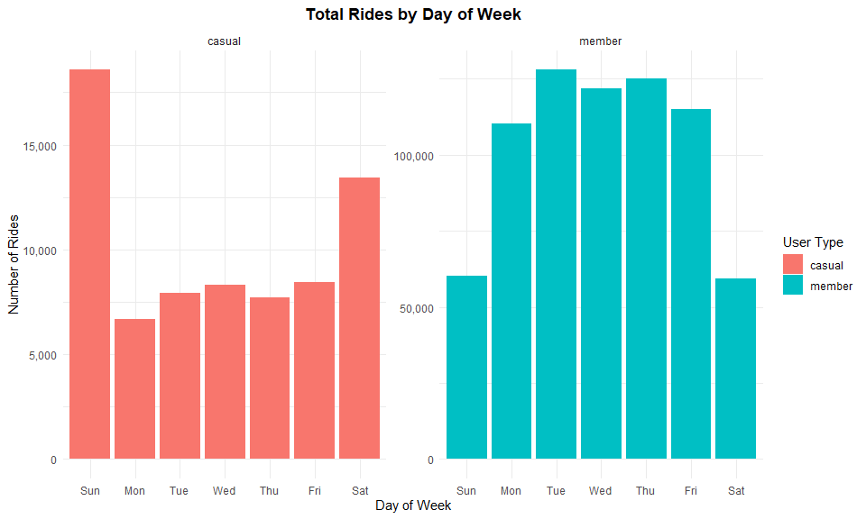
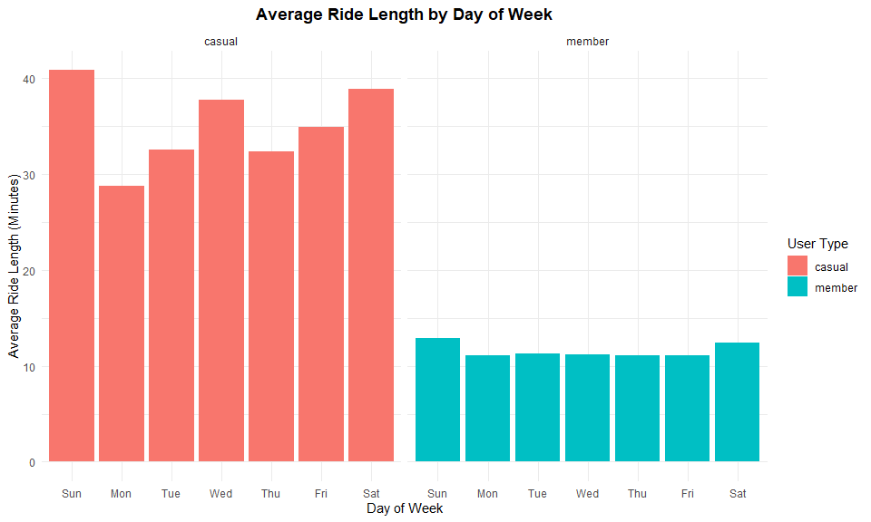
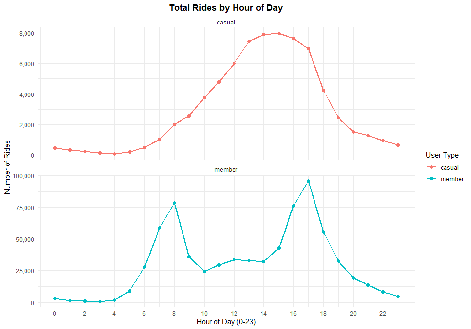
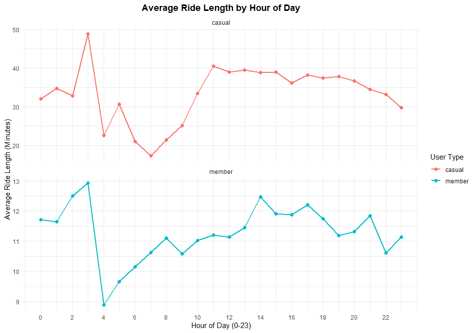

Cyclistic Bike Share Case Study: Understanding Rider Behavior for
Membership Conversion
================
Author : Mayank  

July 26, 2025

- [1 Introduction](#1-introduction)
  - [1.1 Business Task](#11-business-task)
  - [1.2 Objectives](#12-objectives)
- [2 Data Preparation](#2-data-preparation)
  - [2.1 Data Sources](#21-data-sources)
  - [2.2 Data Cleaning and
    Transformation](#22-data-cleaning-and-transformation)
- [3 Findings and Analysis](#3-findings-and-analysis)
  - [3.1 Ride Duration Summary](#31-ride-duration-summary)
  - [3.2 Daily Usage Patterns](#32-daily-usage-patterns)
  - [3.3 Hourly Usage Patterns](#33-hourly-usage-patterns)
- [4 Recommendations](#4-recommendations)
- [5 Conclusion](#5-conclusion)

# 1 Introduction

## 1.1 Business Task

Cyclistic, a Chicago-based bike-share company, is focused on increasing
its annual membership base, which is more profitable compared to casual
ridership. This case study aims to understand **how casual riders and
annual members use Cyclistic bikes differently**, enabling the marketing
team to design targeted strategies to convert casual riders into
members.

## 1.2 Objectives

- Analyze historical trip data to uncover differences in riding behavior
  between casual and member riders.
- Provide actionable insights supported by data and visualizations.
- Deliver clear, evidence-based recommendations for increasing annual
  memberships.

# 2 Data Preparation

## 2.1 Data Sources

- **Divvy Trips:** Historical trip data for 2019 Q1 and 2020 Q1, sourced
  from
  [Kaggle](https://www.kaggle.com/datasets/edgarcovantesosuna/divvy-trips-2019-q1-q4-2020-q1).
- Data is publicly available under the Motivate International
  Inc. license and suitable for analysis.

## 2.2 Data Cleaning and Transformation

Key steps: - Standardized column names and categorical values for
consistency. - Converted timestamps to datetime objects and calculated
**ride length (minutes)**. - Extracted **day of the week** and **hour of
the day** for usage pattern analysis. - Removed rides with missing data
and filtered out invalid ride durations (\>24 hours or ≤0 minutes). -
Merged all cleaned datasets into a single `df_combined` dataframe.

# 3 Findings and Analysis

## 3.1 Ride Duration Summary

| Rider Type | Mean Ride Length (Minutes) | Median Ride Length (Minutes) |
|:-----------|---------------------------:|-----------------------------:|
| Casual     |                      36.46 |                        21.97 |
| Member     |                      11.41 |                         8.47 |

Table 1: Summary of Ride Length by Rider Type

Casual riders take significantly longer trips on average compared to
members. This suggests they primarily use Cyclistic bikes for leisure
and exploration, while members rely on them for shorter, frequent
commutes.

## 3.2 Daily Usage Patterns

<figure>

<figcaption aria-hidden="true">Figure 1: Total Rides by Day of
Week</figcaption>
</figure>

- **Casual riders:** Usage peaks on weekends, indicating leisure trips.
- **Members:** Higher weekday usage, aligning with commuting patterns.

<figure>

<figcaption aria-hidden="true">Figure 2: Average Ride Length by Day of
Week</figcaption>
</figure>

Casual riders’ rides are not only longer overall but **longest on
weekends**, reinforcing the leisure-activity trend.

## 3.3 Hourly Usage Patterns

<figure>

<figcaption aria-hidden="true">Figure 3: Total Rides by Hour of
Day</figcaption>
</figure>

- **Casual riders:** Afternoon peak (1 PM–5 PM), consistent with
  recreational use.
- **Members:** Clear bimodal peaks during commute hours (7–9 AM and 4–6
  PM).

<figure>

<figcaption aria-hidden="true">Figure 4: Average Ride Length by Hour of
Day</figcaption>
</figure>

Casual riders maintain longer trip durations throughout the day, whereas
members keep a consistent, shorter ride length.

# 4 Recommendations

1.  **Target Leisure-Oriented Riders:** Focus campaigns on weekends and
    afternoons; highlight the convenience and value of membership for
    extended leisure trips.
2.  **Communicate Cost Savings:** Use visuals to illustrate how frequent
    long rides make memberships more cost-effective than casual rates.
3.  **Improve Accessibility in High-Demand Areas:** Ensure availability
    at popular weekend destinations; partner with tourist attractions
    and event organizers.

# 5 Conclusion

Cyclistic can significantly increase annual memberships by tailoring its
marketing strategy to casual riders’ behavior. Casual users are
primarily leisure-focused, taking longer weekend and afternoon rides,
while members rely on Cyclistic for short, routine commutes. By aligning
marketing efforts with these insights, Cyclistic can convert more casual
riders into committed members.
